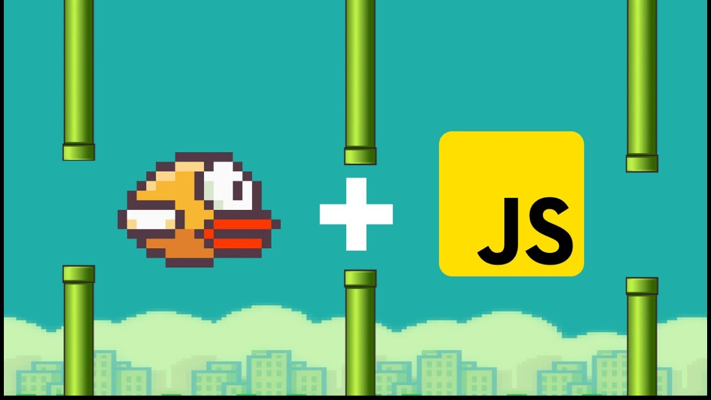

<div align="center" id="top"> 
  

  &#xa0;

</div>

<h1 align="center">Flappy Bird</h1>

<p align="center">
  

  

  
</p>
<p align="center">
  <a href="#dart-sobre">Sobre</a> &#xa0; | &#xa0; 
  <a href="#rocket-tecnologias">Tecnologias</a> &#xa0; | &#xa0;
  <a href="#white_check_mark-como-usar">Como Usar</a> &#xa0; | &#xa0;
  <a href="#joystick-fotos-do-jogo">Fotos do Jogo</a> &#xa0; | &#xa0;
  <a href="#books-padr%C3%B5es-de-commits">Padrões de Commits</a> &#xa0; | &#xa0;
  <a href="https://github.com/Pedrinhonitz" target="_blank">Autor</a>
</p>

<br>

## :dart: Sobre ##

Este é uma implementação simples do clássico jogo Flappy Bird, onde o objetivo é guiar um pássaro através de uma série de canos sem colidir com eles. O jogo oferece três níveis de dificuldade: fácil, médio e difícil, cada um ajustando o espaçamento entre os canos, a velocidade dos canos e a gravidade que afeta a queda do pássaro.

## :rocket: Tecnologias ##

As seguintes ferramentas foram utilizadas neste projeto:

- [HTML](https://developer.mozilla.org/pt-BR/docs/Web/HTML)
- [CSS](https://developer.mozilla.org/pt-BR/docs/Web/CSS)
- [JavaScript](https://developer.mozilla.org/pt-BR/docs/Web/JavaScript)

## :white_check_mark: Como Usar ##
```bash
# Clone
$ git clone https://github.com/Pedrinhonitz/flappy-bird.git

# Entrando na Pasta
$ cd flappy-bird

# Abrindo no VScode
$ code .
```

## :joystick: Fotos do Jogo ##


## :books: Padrões de Commits ##

<table>
  <thead>
    <tr>
      <th>Tipo de commit</th>
      <th>Emojis</th>
      <th>Palavra-chave</th>
    </tr>
  </thead>
 <tbody>
    <tr>
      <td>Correção</td>
      <td>🐛 <code>:bug:</code></td>
      <td><code>fix</code></td>
    </tr>
    <tr>
      <td>Documentação</td>
      <td>📚 <code>:books:</code></td>
      <td><code>docs</code></td>
    </tr>
    <tr>
      <td>Estrutura do Projeto</td>
      <td>🧱 <code>:bricks:</code></td>
      <td><code>ci</code></td>
    </tr>
    <tr>
      <td>Novo recurso</td>
      <td>✨ <code>:sparkles:</code></td>
      <td><code>feat</code></td>
    </tr>
    <tr>
      <td>Testes</td>
      <td>🧪 <code>:test_tube:</code></td>
      <td><code>test</code></td>
    </tr>
  </tbody>
</table>

## Agradecimentos

- Agradecimentos especiais aos criadores das imagens usadas no jogo.

#
Feito por <a href="https://github.com/Pedrinhonitz" target="_blank">Pedrinhonitz</a>

<a href="#top">Voltar ao topo</a>